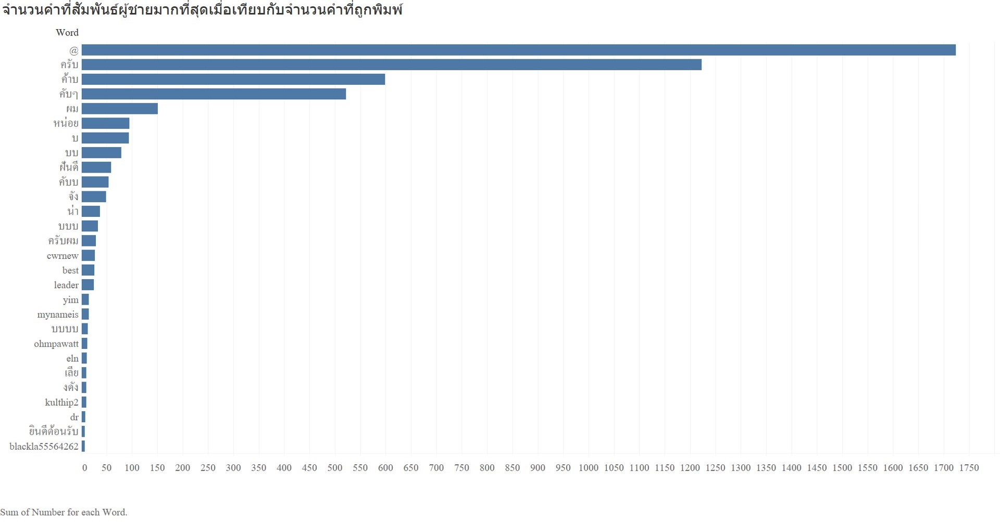

# Project 1 | Classify gender from text จำแนกเพศจากข้อความ

- Machine Learning accuracy 96 %
- Use LogisticRegression

## Tools / Modules

- sklearn
- pythainlp
- numpy
- pandas
- Twint

## API

```http
  GET https://natthanarong.pythonanywhere.com/?word=${word}
```

| Parameter | Type     | Description                       |
| :-------- | :------- | :-------------------------------- |
| `word`      | `string` | **Required**. word to fetch |

- เซิร์ฟเวอร์นี้มีข้อจำกัดการใช้งานสูง(Server free)
 - ประมวลผลได้ไม่เกิน 20 ครั้งต่อวัน
 - ต้องกดต่ออายุทุก 3 เดือน

## Website

**ทดลอง Machine Learning นี้ >> คลิ้กลิ้งด้านล่าง**
- [https://classifygenderthai.netlify.app/](https://classifygenderthai.netlify.app/)

## Data collection
ดึงข้อมูลมาจาก Twitter ด้วย Twint จำนวนประมาณ 250,000 ข้อความ แต่เนื่องด้วยข้อจำกัดทางอุปกรณ์ จึงนำข้อมูลมา 5,000 ข้อความ เพื่อหา feature 10,000 feature  ในการจำแนก แล้วจึงสุ่มข้อความมา 50,000 ช้อความจากชายและหญิงจำนวนเท่าๆกัน แล้วนำมาใส่ feature พบว่ามี 19 ข้อความที่ไม่เจอ feature เลย ข้อความที่นำไปสร้างโมเดลจึงมีทั้งหมด 49,981 ข้อความ

## Data visualization

นี่คือคำที่ถูกพิมพ์มากที่สุด 30 คำจาก 5000 ข้อความ พบว่าส่วนใหญ่เป็นคำพื้นฐาน บางคำเป็นสัญลักษณ์

นี่คือคำที่ผู้ชายพิมพ์มากที่สุด 30 คำจาก 5000 ข้อความ พบว่าส่วนใหญ่เป็นคำลงท้ายประโยค บางคำเป็นสัญลักษณ์

นี่คือคำที่ผู้หญิงพิมพ์มากที่สุด 30 คำจาก 5000 ข้อความ พบว่าส่วนใหญ่เป็นคำลงท้ายประโยค บางคำเป็นสัญลักษณ์

นี่คือคำที่สัมพันธ์กับผู้ชายมากที่สุดเทียบกับคำที่ผู้ชายพิมพ์มากที่สุด พบว่าส่วนใหญ่เป็นคำลงท้ายประโยค บางคำเป็นสัญลักษณ์ บางคำเป็นชื่อ Account
- คำที่สัมพันธ์กับผู้ชายมากที่สุด 30 คำ ได้แก่ 'ครับ', 'ค้าบ', 'คับ', '@', 'ผม', 'บบ', 'คับบ', 'บ', 'ครับผม', 'cwrnew','บบบ', 'ฝันดี', 'จัง', 'บบบบ', 'mynameis', 'yim', 'หน่อย', 'eln','kulthip2', 'งดัง', 'best', 'ohmpawatt', 'leader', 'คับๆ', 'dr', 'น่า','เลีย', 'blackla55564262', 'ยินดีต้อนรับ', 'ครับๆ' ตามลำดับ


นี่คือคำที่สัมพันธ์กับผู้หญิงมากที่สุดเทียบกับคำที่ผู้หญิงพิมพ์มากที่สุด พบว่าส่วนใหญ่เป็นคำลงท้ายประโยค บางคำเป็นสัญลักษณ์ บางคำเป็น Link
- คำที่สัมพันธ์กับผู้หญิงมากที่สุด 30 คำ ได้แก่ 'ค่ะ', 'นะคะ', 'คะ', 'ค่า', '#', 'ตลาดนัด', 'ได้', 'ส่ง', 'ไม่','เรา', '.', 'https', '://', 'co', 't', '/', 'ราคา', 'การ์ด', 'มี','ที่', 'ใบ', '-', 'nct', 'เพิ่มเติม', 'กด', 'สอบถาม', 'แต่', 'ให้','เลย', 'พร้อม' ตามลำดับ

## Authors

- [@NineNatthanarong](https://github.com/NineNatthanarong)